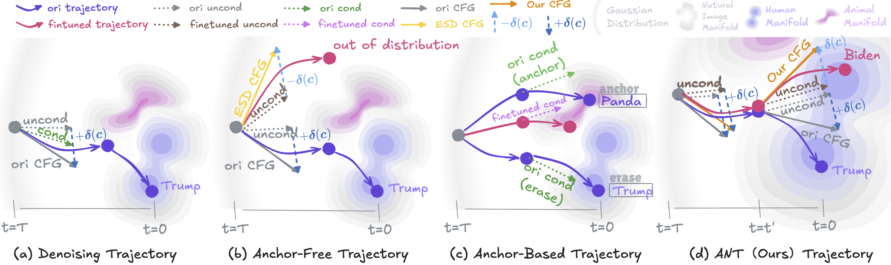

# [ACMMM 2025] Set You Straight: Auto-Steering Denoising Trajectories to Sidestep Unwanted Concepts

[](https://arxiv.org/abs/2504.12782) [](https://huggingface.co/Haerin1/ANT/tree/main)

Official implementation of [Set You Straight: Auto-Steering Denoising Trajectories to Sidestep Unwanted Concepts](https://arxiv.org/abs/2504.12782).

> **Set You Straight: Auto-Steering Denoising Trajectories to Sidestep Unwanted Concepts**<br>
> Leyang Li*, Shilin Lu*, Yan Ren, Adams Wai-Kin Kong <be>
> (* Equal Contribution)
> 
>**Abstract**: <br>
Ensuring the ethical deployment of text-to-image models requires effective techniques to prevent the generation of harmful or inappropriate content. While concept erasure methods offer a promising solution, existing finetuning-based approaches suffer from notable limitations. Anchor-free methods risk disrupting sampling trajectories, leading to visual artifacts, while anchor-based methods rely on the heuristic selection of anchor concepts. To overcome these shortcomings, we introduce a finetuning framework, dubbed ANT, which Automatically guides deNoising Trajectories to avoid unwanted concepts. ANT is built on a key insight: reversing the condition direction of classifier-free guidance during mid-to-late denoising stages enables precise content modification without sacrificing early-stage structural integrity. This inspires a trajectory-aware objective that preserves the integrity of the early-stage score function field, which steers samples toward the natural image manifold, without relying on heuristic anchor concept selection. For single-concept erasure, we propose an augmentation-enhanced weight saliency map to precisely identify the critical parameters that most significantly contribute to the unwanted concept, enabling more thorough and efficient erasure. For multi-concept erasure, our objective function offers a versatile plug-and-play solution that significantly boosts performance. Extensive experiments demonstrate that ANT achieves state-of-the-art results in both single and multi-concept erasure, delivering high-quality, safe outputs without compromising the generative fidelity.

---

</div>



---

## Setup

```bash
conda create -n ant python=3.10
conda activate ant
pip install torch==2.2.0 torchvision==0.17.0 --index-url https://download.pytorch.org/whl/cu121
pip3 install xformers==0.0.24
pip install -r requirements.txt
pip install numpy==1.26.3 
pip install -e git+https://github.com/CompVis/taming-transformers.git@master#egg=taming-transformers
pip install -e git+https://github.com/openai/CLIP.git@main#egg=clip
export PATH=/usr/local/cuda-8.0/bin${PATH:+:${PATH}}
export LD_LIBRARY_PATH=/usr/local/cuda-8.0/lib64
```


## Train

### Single Concept

```
cd Single
```

Download the SD1.4 weights from [here](https://huggingface.co/Haerin1/ANT/blob/main/sd-v1-4-full-ema.ckpt) and move it to `./models/ldm`.

```bash
python train-scripts/train_ant_single.py --config configs/ant_gradient.yaml #you can modify parameters in yaml file
```

After this, you can get a folder containing gradient maps under `./gradient`. Use the following command to generate the saliency map by replacing 'prompt_name' with the name gotten from the last step (not the path).

```bash
python train-scripts/generate_mask.py --prompt_name 'replace_this'
```

At last, you can use the saliency map to train your model, which will be stored in `./models`. Don't forget to modify `mask_path` in yaml file.

```
python train-scripts/train_ant_single.py --config configs/ant_train.yaml
```

### Multiple Concepts

```
cd Multiple
```

Download pre-cached prior knowledge from [here](https://huggingface.co/Haerin1/ANT/tree/main/cache) and move it to ./cache. Then you can run the script to train a LoRA for each concept.

```
pip install diffusers==0.20.0
python train_ant.py --config_file "examples/config.yaml" --erase_type "celebrity"
```

Finally, you can fuse the LoRA to get the final model.

```
pip install diffusers==0.22.0
python fuse_lora_ant.py "examples/erase_cele_100.yaml"
```

## Generate images

### Single Concept

```
cd Single/sample-scripts
python sample.py --model_path 'your_model_path' --csv_path 'csv_file'
```

### Multiple Concepts

```
cd Multiple/sample-scripts
python sample.py --model_path 'your_model_path' --csv_path 'csv_file'
```


## Evaluate

Refer to [this page](https://github.com/Shilin-LU/MACE?tab=readme-ov-file#metrics-evaluation) for nudity, celebrity, and art style evaluation.

We have uploaded our fine-tuned models to HuggingFace. You can download these models if you want to evaluate the model and do not want to train from the start.

| Erasure Type | Fine-tuned Models                                            |
| ------------ | ------------------------------------------------------------ |
| Nudity       | [huggingface](https://huggingface.co/Haerin1/ANT/blob/main/erase_nudity.pt) |
| Celebrity    | [huggingface](https://huggingface.co/Haerin1/ANT/tree/main/erase_celebrity) |
| Art Style    | [huggingface](https://huggingface.co/Haerin1/ANT/tree/main/erase_art) |


## Acknowledgments

Thanks for the following projects that our code is based on: [ESD](https://github.com/rohitgandikota/erasing), [LECO](https://github.com/p1atdev/LECO), [MACE](https://github.com/Shilin-LU/MACE).


## Citation
If you find this project helpful for your research, please consider citing the following BibTeX entry.
```
@article{li2025set,
  title={Set You Straight: Auto-Steering Denoising Trajectories to Sidestep Unwanted Concepts},
  author={Li, Leyang and Lu, Shilin and Ren, Yan and Kong, Adams Wai-Kin},
  journal={arXiv preprint arXiv:2504.12782},
  year={2025}
}

@inproceedings{lu2024mace,
  title={Mace: Mass concept erasure in diffusion models},
  author={Lu, Shilin and Wang, Zilan and Li, Leyang and Liu, Yanzhu and Kong, Adams Wai-Kin},
  booktitle={Proceedings of the IEEE/CVF Conference on Computer Vision and Pattern Recognition},
  pages={6430--6440},
  year={2024}
}
```
